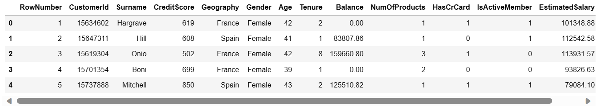
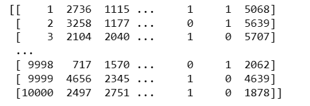
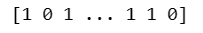
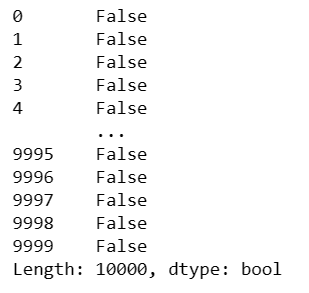
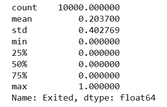
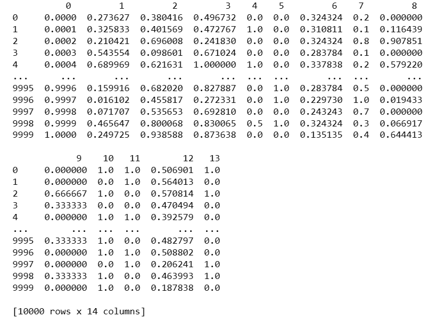
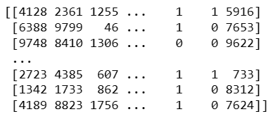
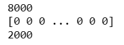

# Ex.No-1 DATA PREPROCESSING
## AIM:
To perform Data preprocessing in a data set downloaded from Kaggle.

## EQUIPMENTS REQUIRED:
Hardware – PCs
Anaconda – Python 3.7 Installation / Google Colab /Jupiter Notebook

## RELATED THEORETICAL CONCEPT:

### KAGGLE:
Kaggle, a subsidiary of Google LLC, is an online community of data scientists and machine learning practitioners. Kaggle allows users to find and publish data sets, explore and build models in a web-based data-science environment, work with other data scientists and machine learning engineers, and enter competitions to solve data science challenges.

### DATA PREPROCESSING:
Pre-processing refers to the transformations applied to our data before feeding it to the algorithm. Data Preprocessing is a technique that is used to convert the raw data into a clean data set. In other words, whenever the data is gathered from different sources it is collected in raw format which is not feasible for the analysis.
Data Preprocessing is the process of making data suitable for use while training a machine learning model. The dataset initially provided for training might not be in a ready-to-use state, for e.g.,it might not be formatted properly, or may contain missing or null values. Solving all these problems using various methods is called Data Preprocessing, using a properly processed dataset while training will not only make life easier for you but also increase the efficiency and accuracy of your model.

### NEED OF DATA PREPROCESSING:
For achieving better results from the applied model in Machine Learning projects the format of the data has to be in a proper manner. Some specified Machine Learning model needs information in a specified format, for example, Random Forest algorithm does not support null values, therefore to execute random forest algorithm null values have to be managed from the original raw data set.
Another aspect is that the data set should be formatted in such a way that more than one Machine Learning and Deep Learning algorithm are executed in one data set, and best out of them is chosen.

## ALGORITHM:
### STEP 1:
Importing the libraries.
### STEP 2:
Importing the dataset.
### STEP 3:
Taking care of missing data.
### STEP 4:
Encoding categorical data.
### STEP 5:
Normalizing the data.
### STEP 6:
Splitting the data into test and train.

## PROGRAM:
```
import io
from sklearn.preprocessing import StandardScaler
from sklearn.preprocessing import MinMaxScaler
from sklearn.model_selection import train_test_split
from sklearn.preprocessing import LabelEncoder
import pandas as pd

#read the dataset
df = pd.read_csv('Churn_Modelling.csv')
df.head()

le=LabelEncoder()

df["CustomerId"]=le.fit_transform(df["CustomerId"])
df["Surname"]=le.fit_transform(df["Surname"])
df["CreditScore"]=le.fit_transform(df["CreditScore"])
df["Geography"]=le.fit_transform(df["Geography"])
df["Gender"]=le.fit_transform(df["Gender"])
df["Balance"]=le.fit_transform(df["Balance"])
df["EstimatedSalary"]=le.fit_transform(df["EstimatedSalary"])

X=df.iloc[:,:-1].values
print(X)

Y=df.iloc[:,-1].values
print(Y)

print(df.isnull().sum())

df.fillna(df.mean().round(1),inplace=True)

print(df.isnull().sum())

y=df.iloc[:,-1].values
print(y)

df.duplicated()

print(df['Exited'].describe())

scaler= MinMaxScaler()

df1=pd.DataFrame(scaler.fit_transform(df))
print(df1)

x_train,x_test,y_train,x_test=train_test_split(X,Y,test_size=0.2)
print(x_train)

print(len(x_train))

print(x_test)

print(len(x_test))
```

## OUTPUT:
### PRINTING THE FIRST FIVE ROWS AND COLUMNS OF THE DATASET:

### SEPARATING X AND Y VALUES:


### CHECKING NULL VALUE IN THE DATASET:

### PRINTING Y COLUMN ALONG WITH ITS DIRECTION:

### APPLYING DATA PREPROCESSING TECHNIQUES AND PRINTING THE DATASET:

### PRINTING DATASET:

### PRINTING TESTING SET AND LENGTH OF IT:


## RESULT:
Hence, the data preprocessing is done using the above code and data has been splitted into training and testing data for getting a better model.

